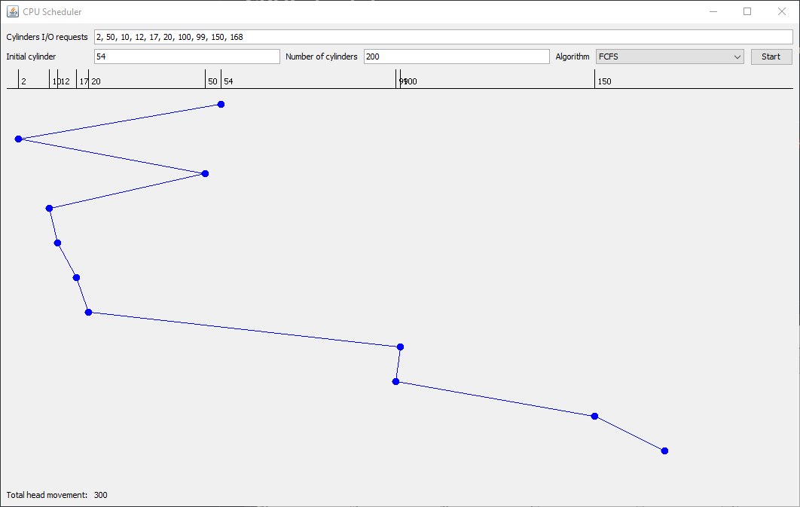
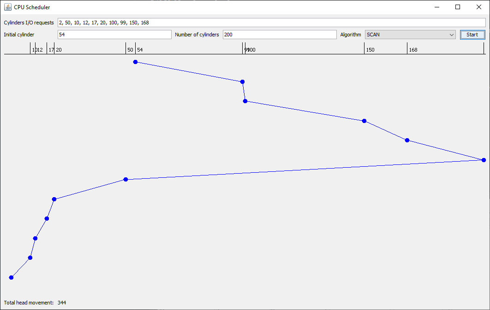
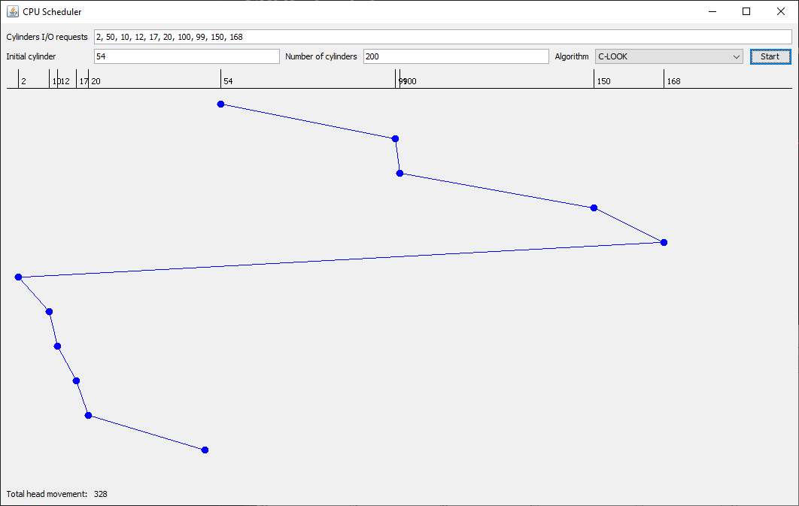

# Disk scheduling algorithm visualizer

Visualizing the following [disk scheduling](https://en.wikipedia.org/wiki/I/O_scheduling) algorithms:

- First Come, First Served (FCFS)
- Shortest Seek Time First (SSTF)
- [SCAN](https://en.wikipedia.org/wiki/Elevator_algorithm) (Elevator algorithm)
- Circular SCAN (CSCAN)
- [LOOK](https://en.wikipedia.org/wiki/LOOK_algorithm)
- Circular LOOK (CLOOK)

Featuring a graphical user interface to show seek head movement and calculate total movement. Was made as an assignment for the Advanced Operating Systems course taught in Cairo University Faculty of Computers and Artificial Intelligence.

## Screenshots

## See also
- [CPU Scheduling](https://github.com/KareemMAX/CPUScheduling)
